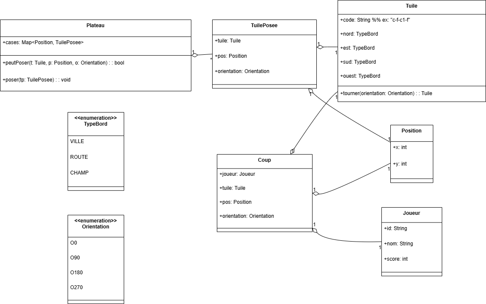

## Modèle minimal du jeu Carcassonne

Le diagramme de classes présente un modèle minimaliste du jeu Carcassonne, limité aux éléments nécessaires pour représenter le placement des tuiles sur le plateau.

Le modèle repose sur les concepts suivants :
- **Joueur** : représente un participant à la partie (humain ou programme).
- **Position** : coordonnée *(x, y)* sur le plateau de jeu.
- **Tuile** : tuile Carcassonne identifiée par un code et caractérisée par ses quatre bords (ville, route ou champ).
- **TuilePosée** : association d’une tuile, d’une position et d’une orientation, représentant une tuile effectivement placée sur le plateau.
- **Plateau** : structure centrale qui maintient l’état du jeu et permet de vérifier et d’appliquer les placements.
- **Coup** : action proposée par un joueur consistant à poser une tuile à une position donnée avec une orientation donnée.

Ce modèle volontairement simple permet de reconstruire l’état du jeu à partir d’un flux de messages et constitue une base extensible pour l’implémentation du projet.

