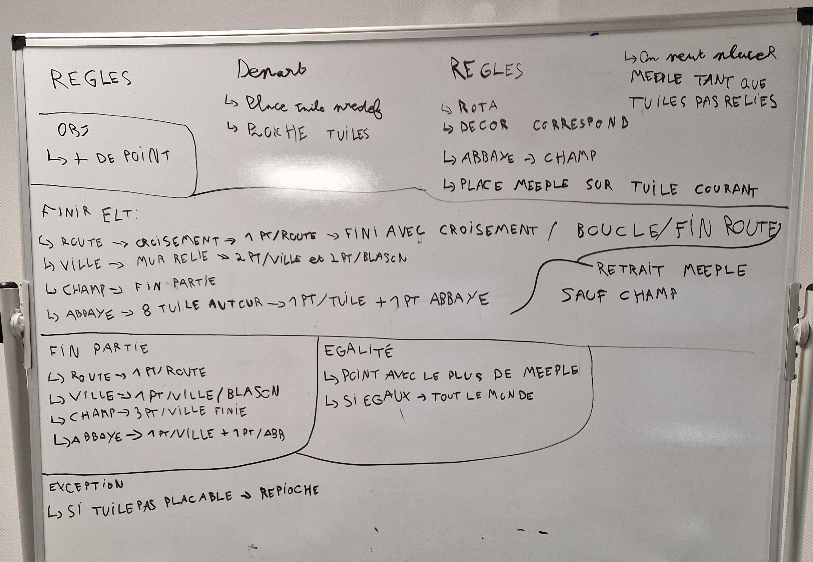

# l3s6-projet-g2-ASAA

## Membre de l'équipe

- Boudjou Aya
- SEDKI Safa
- GOSLIN Antonin
- PHILIPPE Alexandre

## Coordinateur de l'équipe :

- PHILIPPE Alexandre

## Outils de gestion de projet

- Tableau Trello (pour l'organisation et la  répartition des tâches) :
https://trello.com/invite/b/695e22dddb0d77f64fe0902e/ATTI1ef83564714f69a1aa0a69048812cba2A0BBD725/-

## Journal de Bord

### Semaine 1

- Constitution de l’équipe de projet.
- Désignation du coordinateur de l’équipe.
- Lecture individuelle et collective du sujet du projet Carcassonne.
- Création du groupe GitLab **l3s6-projet-g2-ASAA** et des premiers dépôts.
- Mise en place des bases de l’organisation du projet.
- Premiere discussion sur les choix technologique et proposition initale sur les language de programmation à utiliser : 
- **Java**
- **Python**

### Semaine 2
#### SEDKI Safa :
 - **Réflecteur** : le réflecteur est un serveur de communication générique qui reçoit les messages envoyés par les clients et les rediffuse à tous les participants dans le même ordre, sans interpréter le contenu du jeu.
- **Enregistreur** : j’ai implémenté un enregistreur en Python qui se connecte passivement au réflecteur via WebSocket, écoute le flux de messages et enregistre chaque message reçu tel quel dans un fichier texte, à raison d’un message par ligne.
- **Tests** : le fonctionnement a été validé en lançant le réflecteur sous Windows (`.\reflector.exe`), puis l’enregistreur (`python Enregistreur.py "ws://localhost:3000" "test-simple.txt"`), et enfin en envoyant des messages de test depuis un client Python (`python -c "import asyncio, websockets; async def main(): async with websockets.connect('ws://localhost:3000') as ws: await ws.send('Alice ENTERS'); await ws.send('Alice HELLO'); await ws.send('Alice CLOSES'); asyncio.run(main())"`), ce qui permet de vérifier que le fichier contient les messages dans l’ordre d’émission.
#### GOSLIN Antonin
- V1 serveur qui sera remplacé integralement par le reflecteur
- V1 du client qui seront revus pour utiliser des roles

### BOUDJOU Aya
- Mise en place du rediffuseur Java
- Lecture d'un fichier de persistance (messages ligne par ligne)
- Envoi des messages au réflecteur dans l'ordre
- Gestion des lignes vides et commentaires (`#`)
- Tests avec fichier de démonstration + vérification de la rediffusion côté client

### Semaine 3
#### Tous
- Mise en place des règles de carcassonne
.

### Semaine 4

# Travail effectué 
## Antonin 
- Mise en place de la classe Meeple et de la logique lié autour des meeples(uniquement le placemenet pour le moment, les points et regles seront definies plus tard)

### Semaine 5
#### Difficulté 
- mettre en place le découpage des tuiles dans le but de faciliter la lecture graphique ainsi que la pose de Meeple.
- la création de la tuile depend d'une représentation d'un string -> création d'un TuileFactory pour pouvoir parser cette chaine et créer automatiquement la tuile correspondante
- struture du projet floue -> refactoring et organisation du projet dans un /src avec toute les sources ainsi que leurs packages
- Il est dificile de compiler toute les composants -> makefile

#### Décisions
- quand il y a une route sur la tuile, celle-ci passe forcément par le segment du centre sauf dans le cas ou une abbaye ou une ville s'y trouve déjà 
- les blasons et abbayes n'etaient pas crées dans les tuiles -> ajout de boolean permettant de le faire 

# Travail effectué 
## Antonin
- Mise en place des premiers tests
- Refactoring 
- Classe TuileFactory

### Semaine 6

#### Difficulté
- Logique des segments 
- Adaptation de code

#### Décisions
- Pair programming pour faire une refonte de la logique de Tuile pour l'adapter au segments

### Semaine 7

# Travail effectué 
## Alexandre
- Refactoring des classes Tuile et Plateau
- Refactoring de la logique de certaines classes

## Antonin
- Suite des Tests et du makefile
- Mise en place du TuileV3

### Dificulté
- Pour le moment la classe meeple prend en parametre un string pour la zone et pas un segment type, il faudra modifier la logique
- Voir les cas complexes du TuileFactory

### Semaine 8

# Travail effectué 
- Pair programming pour adapter la logique des tuiles et du plateau
- schema du main du jeu

### Semaine 9

# Travail effectué
- Ecriture du dossier retrospectif

### Semaine 10

#### Antonin 
- Mise en place de la V1 du main pour le jeu
- Classe sacTuiles et TuileManager pour la création des tuiles
- Pair programming pour corriger l'affichage et la création des tuiles du jeu
#### Alexandre 
Correction du code de serveur_test.py qui nous permet maintenant de faire le relais entre le reflecteur et des clients distants.
Correction de la classe TuileV2 afin de mettre en place l'orientation des tuiles dans cette nouvelle version.

### Semaine 11

#### Antonin
- Suite du main 
- Ajout de la class arbitre pour faire le liens entre le main et les clients
- Ajout du main reseau

### BOUDJOU Aya 
- Début de RegleMeeple.
- Première version fonctionnelle sur les cas simples.
- Vérification trop globale par type de segment.
- Limite trouvée sur des segments voisins de même type.

### Semaine 12

#### Antonin 
- Suite de la logique reseau avec adaptation de client.py et MainReseau.java et des classes utilisés par ces deux fichiers.
- Mise en place de la logique de placement des tuiles et meeples en reseau.
- Affichage du plateau en reseau
- Ajouts des tests manquants pour les tuiles et le plateau
- Correction de la documentation
- Mise a jour du makefile
- Correction de l'affichage du plateau

### BOUDJOU Aya 
- Correction de RegleMeeple, passage d'une vérification  par type à une vérification par index
- Distinction des segments de même type mais zones différentes
- Mise à jour des tests RegleMeeple et validation des cas principaux